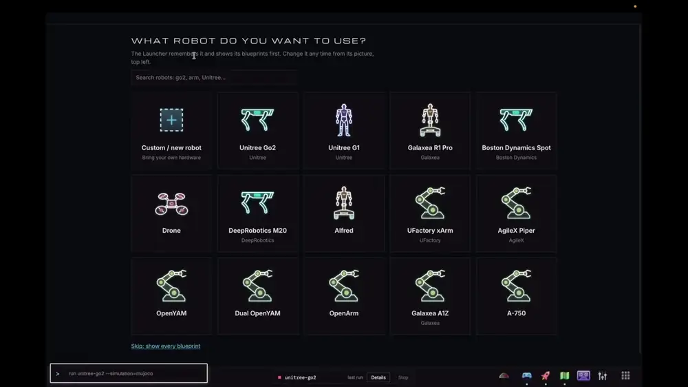

# DimOS Desktop

The unified interface for controlling the physical world with [dimOS](https://github.com/dimensionalOS/dimos). One command installs dimos and everything it needs; then you pick a robot and launch it on the real hardware, a recording, or a simulator. It all runs in your browser: drive the robot, watch its 3D map and cameras, record runs, and add more apps.


[](docs/media/clips.mp4?raw=true)

Above: pick a robot and a blueprint, launch a Go2 in simulation, watch it map ([as a video file](docs/media/clips.mp4?raw=true)).

| Install | Pick a robot | Pick a blueprint |
| --- | --- | --- |
|  |  |  |

## Install

```sh
# todo: switch to non-mirror once public
curl -fsSL https://raw.githubusercontent.com/jeff-hykin/dimos-desktop-mirror/main/install.sh | bash
```

# Build Your Own App in Minutes!

Start from an example: [Make your own dimOS app](docs/create-apps/index.md).

| Example                                                       | Stack                                                                                         | Pick it when                                                          |
| ------------------------------------------------------------- | --------------------------------------------------------------------------------------------- | --------------------------------------------------------------------- |
| [simple-html](https://github.com/jeff-hykin/dim-example-html) | one `frontend/index.html`, no build, no server                                                | the page can do tons: viewers, dashboards, teleop                     |
| [deno-server](https://github.com/jeff-hykin/dim-example-deno) | React, Vite, Deno server + [zenoh-deno](https://github.com/jeff-hykin/zenoh-deno) (zero-copy) | read files, zero-copy zenoh topics, run parallel background jobs, etc |
| [rust](https://github.com/jeff-hykin/dim-example-rust)        | Rust server, plain page                                                                       | Bluetooth scans, UART ports, heavy video processing, etc              |

How do I notify, open an app, run a sudo command, ...: [docs/how-to.md](docs/how-to.md). All the docs: [docs/](docs/).

On a Steam Deck: [docs/steam-deck.md](docs/steam-deck.md) (launch it from Steam so the controls are a gamepad).
