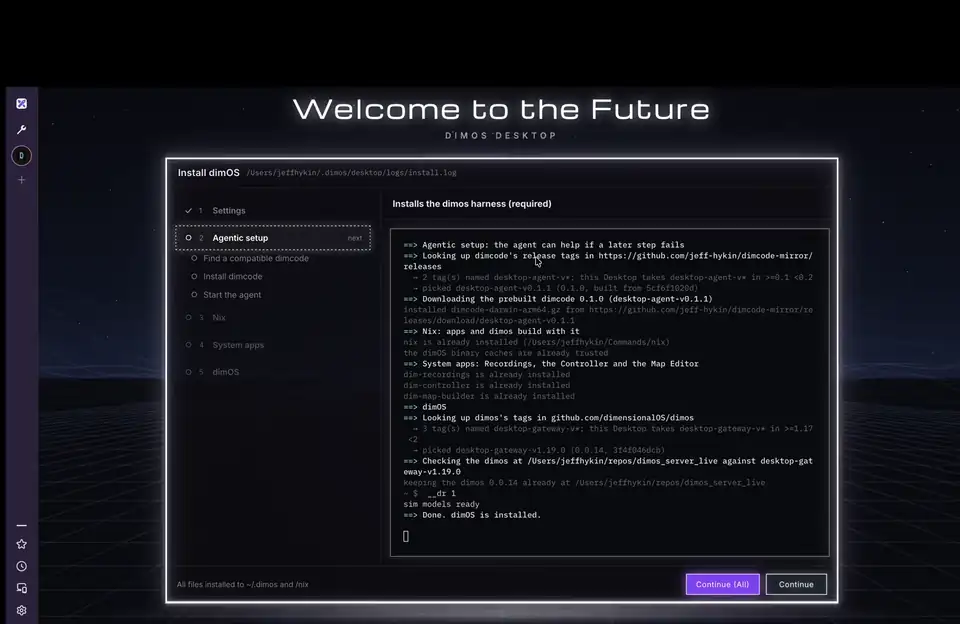
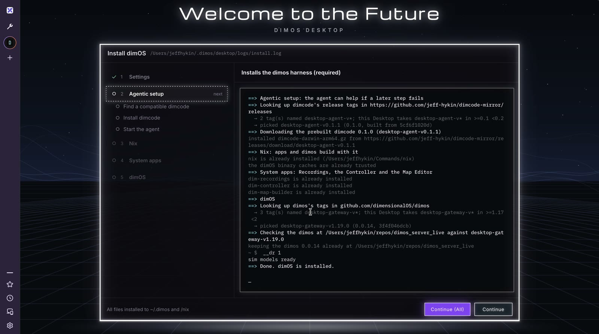
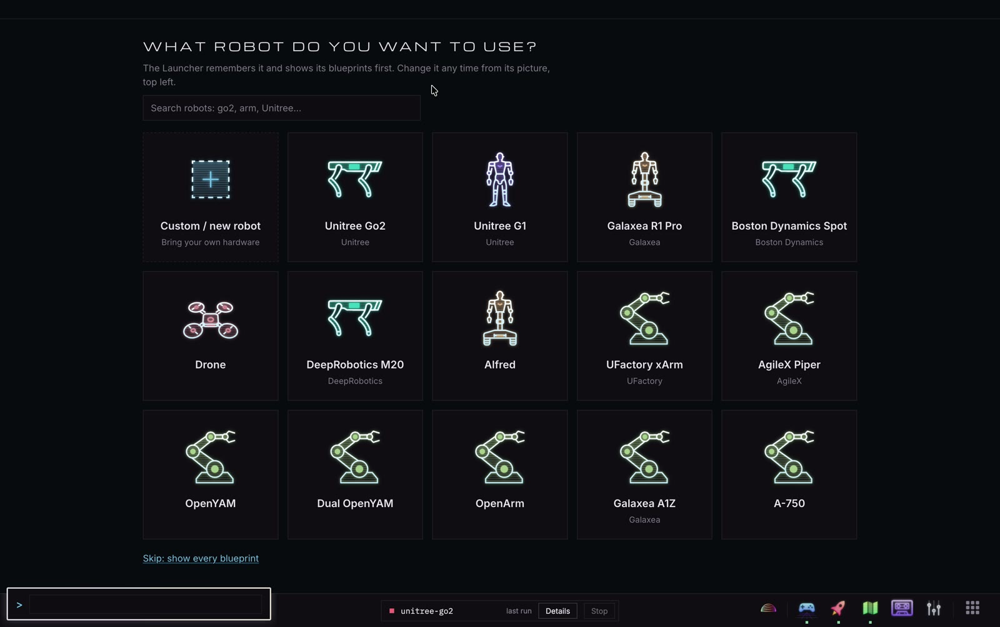
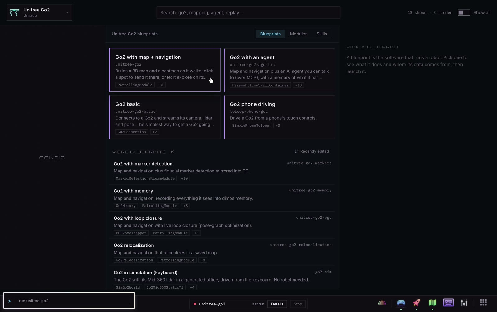

# dimOS Desktop

dimOS Desktop is one app for running robots with [dimOS](https://github.com/dimensionalOS/dimos).
One command installs dimos and everything it needs; then you pick a robot and launch it on the real hardware, a recording, or a simulator.
It all runs in your browser: drive the robot, watch its 3D map and cameras, record runs, and add more apps.


[](docs/media/demo.mp4?raw=true)

Above, sped up: install, pick a robot, launch a Go2 in simulation, watch it map ([as a video file](docs/media/demo.mp4?raw=true)).

| Install | Pick a robot | Pick a blueprint |
| --- | --- | --- |
|  |  |  |

Install dimOS Desktop (Linux and macOS):

```sh
# todo: switch to non-mirror once public
curl -fsSL https://raw.githubusercontent.com/jeff-hykin/dimos-desktop-mirror/main/install.sh | bash
```

Building an app: [docs/how-to.md](docs/how-to.md) (how do I notify, open an app, run a sudo command, ...). All the docs: [docs/](docs/).

On a Steam Deck: [docs/steam-deck.md](docs/steam-deck.md) (launch it from Steam so the controls are a gamepad).
