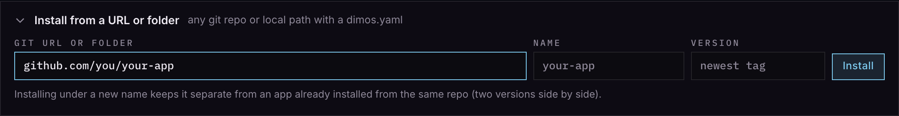

# Make Your own DimOS App!

Here's three example apps:

| Example                                                       | Stack                                                                                         | Pick it when                                                          |
| ------------------------------------------------------------- | --------------------------------------------------------------------------------------------- | --------------------------------------------------------------------- |
| [simple-html](https://github.com/jeff-hykin/dim-example-html) | one `frontend/index.html`, no build, no server                                                | the page can do tons: viewers, dashboards, teleop                     |
| [deno-server](https://github.com/jeff-hykin/dim-example-deno) | React, Vite, Deno server + [zenoh-deno](https://github.com/jeff-hykin/zenoh-deno) (zero-copy) | read files, zero-copy zenoh topics, run parallel background jobs, etc |
| [rust](https://github.com/jeff-hykin/dim-example-rust)        | Rust server, plain page                                                                       | Bluetooth scans, UART ports, heavy video processing, etc              |

There's a [for-agents.md](for-agents.md) if you want to offload the work. They're especially good at following the
[themes guide](themes.md) and [icon style guide](make-an-icon.md).

## 1. Required Stuff

1. A git repo
2. versioning the git repo with git tags that follow the v1.1.1 pattern
3. A `dimos.yaml` that declares what dimos API's your app will use (in OpenAPI standard)
4. An `icon.svg` in the root of your app
5. Either a `flake.nix` for building your Unix domain socket server, or a `frontend/index.html` if you want a frontend
   only app.

## 2. How can I do X?

### Run your own copy of an example

1. On the example's GitHub page, click **Use this template** to make your repo.
2. Desktop → **App Store** → **Install From URL**, paste your repo, **Install**:



Push a change, then **Update** it in the App Store. No `vX.Y.Z` tag yet: it installs the default branch.

### There's a few tools in the toolbox

- Subscribe or publish topics? The
  [zenoh-gateway](https://github.com/jeff-hykin/zenoh-gateway/blob/main/docs/how-to.md).
- Run a sudo command? The
  [DimApp terminal tool](https://github.com/jeff-hykin/dim-app#terminal-tool-run-a-shell-command-sudo-too-in-desktop).
- Launch a blueprint, or list a module's inputs and outputs? The
  [dimos gateway](https://github.com/dimensionalOS/dimos/blob/jeff/feat/dimos_server/docs/usage/gateway-how-to.md).
- Notifications, opening apps, Desktop events? The [desktop gateway](../how-to.md).
- Want Desktop's agent to call your app? The agentic gateway ([agent.md](../agent.md)): list your endpoints under
  `provides:` (§4).

## 3. Examples

With [dim-app](https://github.com/jeff-hykin/dim-app), from a page:

```js
import { DimApp, notify, openApp } from "https://esm.sh/gh/jeff-hykin/dim-app@v0.20.4/mod.js"

const app = new DimApp({ msgDecodeEndpoint: "../../dimos/msgs.js" })

// odom, decoded
app.subscribe("odom", (odom) => console.log(odom.pose.pose.position))

// a camera into <video id="camera" autoplay muted playsinline>
const options = { delivery: "latest", maxHz: 30, encoding: "dimos_lcm_image" }
app.zenoh.subscribe("dimos/color_image/sensor_msgs.Image", options, ({ mediaStream }) => {
    if (mediaStream) {
        camera.srcObject = mediaStream
    }
})

// call a skill (only from a click: a skill can move the robot)
const { skills } = await (await fetch("../../dimos/skills")).json()
callButton.onclick = () =>
    fetch("../../dimos/skills/call", {
        method: "POST",
        headers: { "content-type": "application/json" },
        body: JSON.stringify({ skill: skills[0].name, module: skills[0].module, args: {} }),
    })

// open the Launcher on blueprints that can drive
openApp("launcher", { stream: "cmd_vel" })

// a notification
notify({ title: "Map saved", body: "office.pgm", kind: "ok" })
```

Then declare those calls in `dimos.yaml` (undeclared calls get a 403):

```yaml
uses:
    "@dimos-gateway": [GET /msgs.js, GET /skills, POST /skills/call]
    "@desktop-gateway": [POST /api/notifications]
    "@zenoh-gateway": ">=0.5.1"
```

## 4. Offer an API

Put your button presses, searches, list results, every meaningful action on the backend and declare it so that agents
can use it. A route in the [deno example](https://github.com/jeff-hykin/dim-example-deno/blob/main/backend/main.ts)
(Desktop strips `/apps/<name>`):

```ts
if (route === "POST /api/notes") {
    const { text } = await request.json()
    return json({ notes: await addNote(text) })
}
```

Backend → page is always zenoh. The backend publishes:

```js
import { publishFrontend } from "https://esm.sh/gh/jeff-hykin/dim-app@v0.20.4/mod.js"
publishFrontend("events", { type: "saved", id })
```

Any language: `POST <desktopUrl>/desktop/frontend/<name>/events` with the body. The page listens:

```js
import { appEvents } from "https://esm.sh/gh/jeff-hykin/dim-app@v0.20.4/mod.js"
appEvents((event) => console.log(event))
```

Declare it:

```yaml
provides:
    description: "Keeps a list of notes"
    endpoints: # public: the agent and other apps may call these
        - method: POST
          path: api/notes
          description: Add a note
          params:
              text: { type: string, description: the note }
    private: # only your own pages
        - api/internal/*
```

## 5. Prebuilt binaries

Compiling with nix takes a long time. Be kind and precompile your app so users can instant-download your app. You can do
this by pushing to cachix and then telling the dimos.yaml about your cachix push:

1. Make a cache at [cachix.org](https://www.cachix.org); add its auth token to the repo's secrets as
   `CACHIX_AUTH_TOKEN`.
2. CI builds and pushes:

```yaml
- uses: cachix/install-nix-action@v31
- uses: cachix/cachix-action@v16
  with:
      name: your-cache
      authToken: ${{ secrets.CACHIX_AUTH_TOKEN }}
- run: nix build .#dimosApp -L
```

3. Declare it in `dimos.yaml`:

```yaml
caches:
    - url: https://your-cache.cachix.org
      key: "your-cache.cachix.org-1:..."
```

The App Store gives users the one sudo command to trust it. Cross builds for robots: `nix.cache` in
[apps.md](../apps.md).

## 6. flake.nix

This has to work from your repo's root, on Mac and Linux:

```sh
nix build .#dimosApp
```

`./result` then holds either a `bin/dimos-app-server` (Desktop runs it, with `DIMOS_APP` set) or an `index.html` (a page
with no server).

Anything nix can build can be a dependency: Python with CUDA, ROS, a Rust crate with C libraries, a model file, a pinned
compiler. Put it in the flake and the user never installs it by hand. Start from an example's `flake.nix`.

## 7. Checklist

- [ ] **Icon**: `icon.svg` at the root, per [make-an-icon.md](make-an-icon.md).
- [ ] **Theme**: link `../../theme.css`, use only its tokens, per [themes.md](themes.md).
- [ ] **flake.nix**: exposes `packages.<system>.dimosApp`; copy an example's. Static apps (`frontend/index.html`) skip
      it.
- [ ] **Check**: `dimos-desktop app check <your repo>` passes.
- [ ] **Release**: tag `vX.Y.Z` and push the tag. Desktop installs and updates to the newest tag. A beta for testers is
      `vX.Y.Z-beta` (any suffix): never installed by updates, pickable in the version menu.
